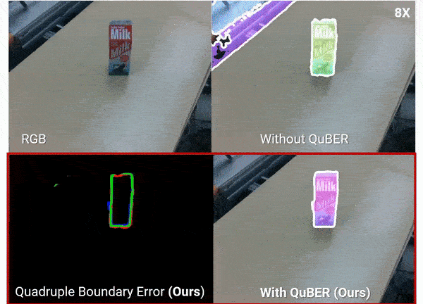

# QuBER

[[Paper]](https://arxiv.org/abs/2306.16132) [[Project Website]](https://sites.google.com/view/uois-quber) 



This repository contains the source codes for the paper "High-Quality Unknown Object Instance Segmentation via Quadruple Boundary Error Refinement".

The paper has been authored by Seunghyeok Back, Sangbeom Lee, Kangmin Kim, Joosoon Lee, Sungho Shin, Jaemo Maeng, and Kyoobin Lee.

Accepted at **ICRA 2025**

## TODO
- [ ] Add demo code
- [ ] Add more segmentation and refinment baselines (e.g. UCN, CascadePSP)
- [ ] Training instructions


## Install
Tested on Ubuntu, PyTorch 1.10, CUDA 11.3, 
```
conda create -n quber python=3.8
conda activate quber

# for CUDA 11.8, install torch, detectron2
conda install pytorch==1.10.0 torchvision==0.11.0 torchaudio==0.10.0 cudatoolkit=11.3 -c pytorch -c conda-forge
python -m pip install 'git+https://github.com/facebookresearch/detectron2.git'

# Install Grounded-SAM 
git clone https://github.com/IDEA-Research/Grounded-Segment-Anything
cd Grounded-Segment-Anything
export AM_I_DOCKER=False
export BUILD_WITH_CUDA=True
export CUDA_HOME=/usr/local/cuda-11.8/
python -m pip install -e segment_anything
pip install --no-build-isolation -e GroundingDINO

# install other dependencies
pip install git+https://github.com/cocodataset/panopticapi.git
pip install -r requirements.txt
```

## Dataset & Checkpoints

Download the following dataset to `datasets` folder.
- OSD Dataset: [[link]](https://drive.google.com/file/d/14qbSntF8ZXwJbZzwe-929EA6QP35dfF-/view?usp=sharing)
- OCID Dataset: [[link]](https://drive.google.com/file/d/1lCsNxoN50CM1efTAg95eK7bZwPL7YjKq/view?usp=sharing)
- UOAIS-SIM: [[link]](https://drive.google.com/file/d/1yN6ixntOxQRx-UFPV9-wi9R7iODJh-Nw/view?usp=drive_link)
- checkpoints: [[link]](https://drive.google.com/drive/folders/1XbNarummh1C49n_pGsvCRJ9yHZIOITym?usp=sharing)


## Evaluation

```
python eval/run_eval.py \
    --base-model sam \
    --refiner-model quber \
    --test-dataset OSD \
    --visualize --config configs/quber.yaml
```


## Contact

Should you have any questions or comments about our project, feel free to reach out to us at <shback@kimm.re.kr> or open an issue in this repository.
